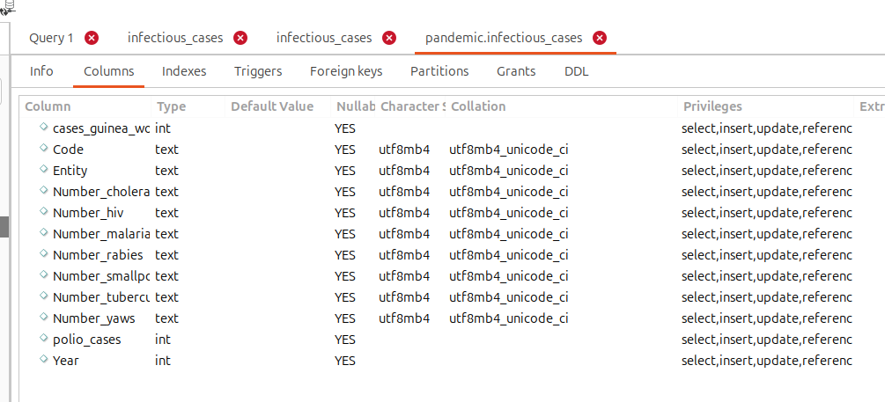
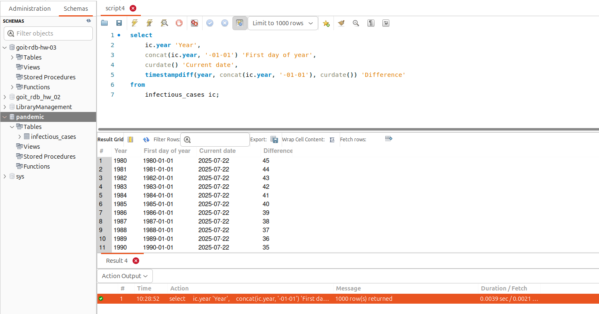
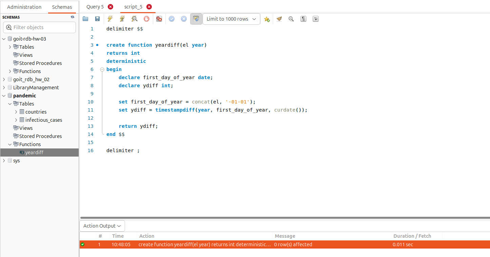
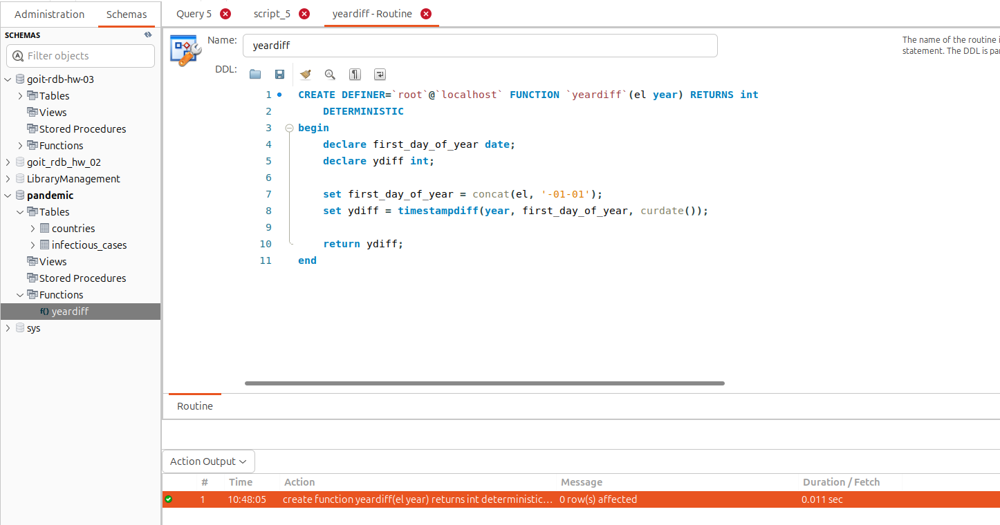

# Опис фінального проєкту

### 1. Завантажте дані:

### Скрипт завдання 1 ([script_1.sql](./script_1.sql))

### Workbanch

- Створіть схему pandemic у базі даних за допомогою SQL-команди.

- Оберіть її як схему за замовчуванням за допомогою SQL-команди.

- Імпортуйте дані за допомогою Import wizard так, як ви вже робили це у темі 3.

- Продивіться дані, щоб бути у контексті.

Так як тип даних трішки кривуватий (див колонку `Type`)

приведемо поля таблиці до правильних типів та виправимо деякі дані у полях таблиці

тепер поля мають правильні типи

### 2. Нормалізуйте таблицю infectious_cases до 3ї нормальної форми. Збережіть у цій же схемі дві таблиці з нормалізованими даними.

Виконайте запит `SELECT COUNT(*) FROM infectious_cases` , щоб ментор міг зрозуміти, скільки записів ви завантажили у базу даних із файла.

### Скрипт завдання 2 ([script_2.sql](./script_2.sql))

### Workbanch

### 3. Проаналізуйте дані:

Для кожної унікальної комбінації `Entity` та `Code` або їх `id` порахуйте середнє, мінімальне, максимальне значення та суму для атрибута `Number_rabies`.

Результат відсортуйте за порахованим середнім значенням у порядку спадання.
Оберіть тільки 10 рядків для виведення на екран.

### Скрипт завдання 3 ([script_3.sql](./script_3.sql))

### Workbanch

### 4. Побудуйте колонку різниці в роках.

Для оригінальної або нормованої таблиці для колонки `Year` побудуйте з використанням вбудованих `SQL-функцій`:

- атрибут, що створює дату першого січня відповідного року,
- атрибут, що дорівнює поточній даті,
- атрибут, що дорівнює різниці в роках двох вищезгаданих колонок.

### Скрипт завдання 4 ([script_4.sql](./script_4.sql))

### Workbanch

### 5. Побудуйте власну функцію.

Створіть і використайте функцію, що будує такий же атрибут, як і в попередньому завданні: функція має приймати на вхід значення року, а повертати різницю в роках між поточною датою та датою, створеною з атрибута року (`1996` рік → `‘1996-01-01’`).

### Скрипт завдання 5 ([script_5.sql](./script_5.sql))

### Workbanch

якшо відкрити функцію на редагування

